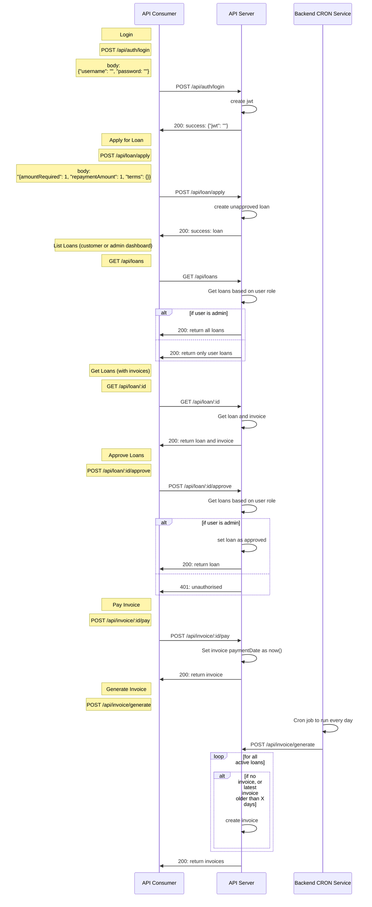

# Mini Aspire

### script steps to run and use:

- Duplicate `.env.example` as `.env` fill in the details (make sure you have a MySQL db ready)
- `source install-part-1.sh`
- After the server start, stop it (ctrl-c)
- `source install-part-2.sh`

### manual steps to run and use:

- Install dependencies `npm i`
- Duplicate `.env.example` as `.env`
- run `npm install -g env-cmd sequelize-cli`
- Update env vars in `.env`
- Start services `env-cmd -f ./.env npm run dev ` (to initialize the db)
- Stop services (ctrl-c)
- Run migration `env-cmd -f ./.env npx sequelize db:migrate `
- Run seed `env-cmd -f ./.env npx sequelize db:seed:all `
- Start services `env-cmd -f ./.env npm run dev `
- Send API requests to http://localhost:${PORT}

### Technology used:

- Server: Node.jswritten in Typescript
- API framework: Express.js
- Database: MySQL,
- ORM: Sequelize
- Testing: Jest, Sinon and Supertest

### App Structure

```bash
/src
  /controllers
  /db # db and data models
  /enums
  /utils # helper functions
/test
  /unit # unit tests
app.js # express app
index.js # server entry point
routes.js
```

### Migrations

- sequelize-cli is used to manage db schema migrations
- Apply migrations `env-cmd -f ./.env npx sequelize db:migrate `
- Rollback `env-cmd -f ./.env npx sequelize db:migrate:undo`
- Creating migration `env-cmd -f ./.env npx sequelize migration:generate --name xxxxx`
- Apply seed `env-cmd -f ./.env npx sequelize db:seed `

### Development

- Install dependencies `npm i`
- Duplicate `.env.example` as `.env`
- run `npm install -g env-cmd`
- Update env vars in `.env`
- Start services `env-cmd -f ./.env npm run dev `

### Testing

- Start services `env-cmd -f ./.env npm run test `

### API Diagram


